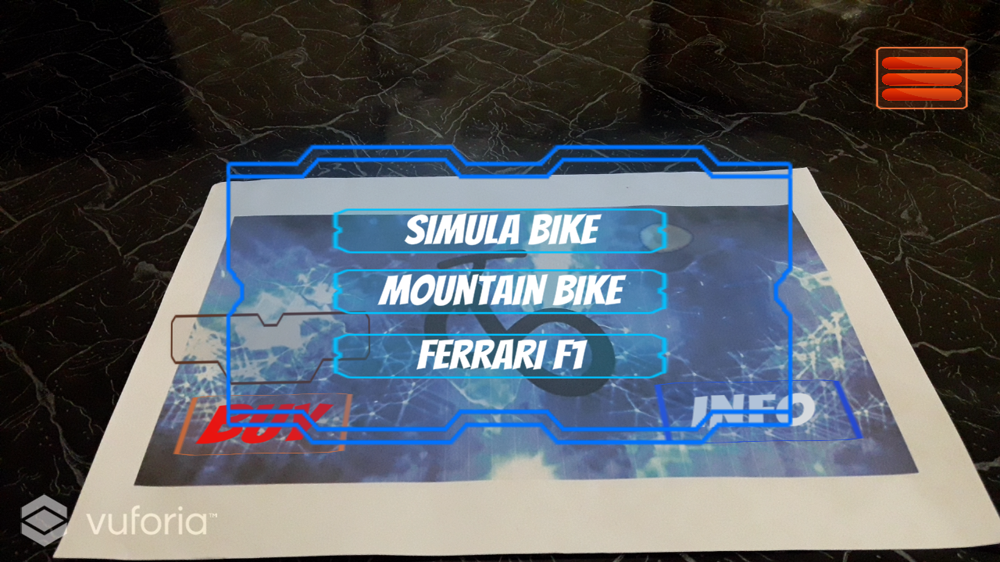
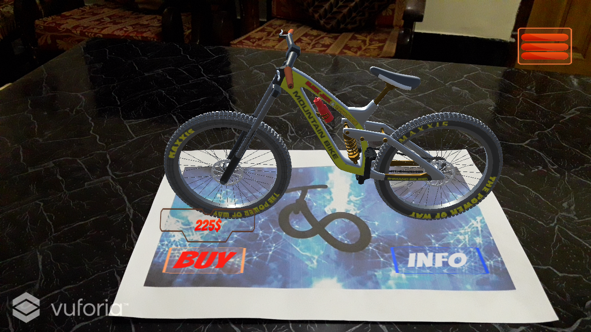
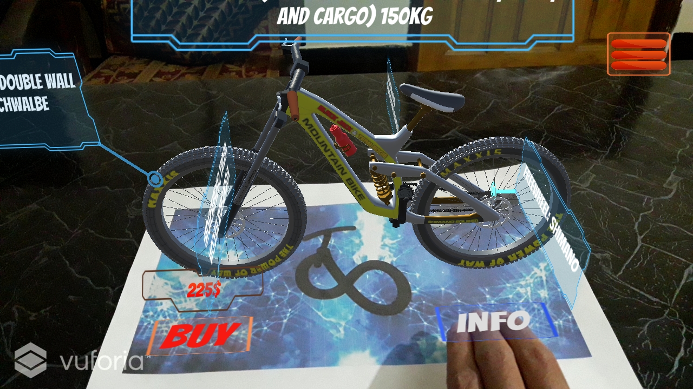
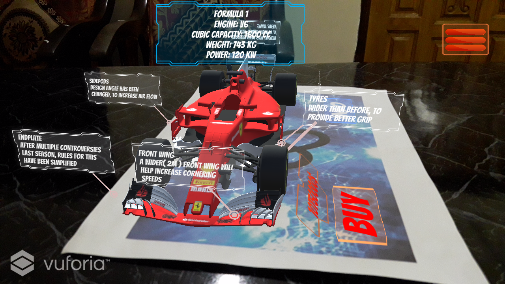
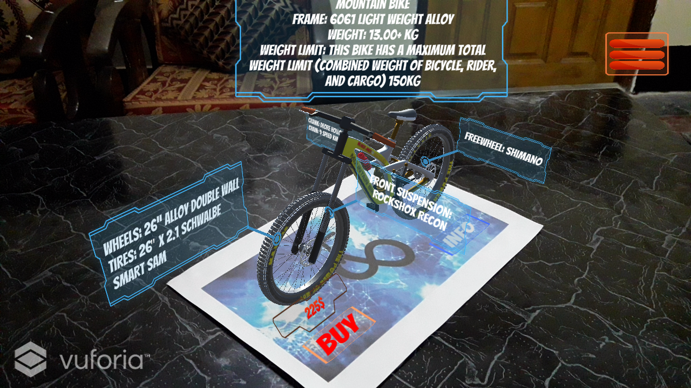
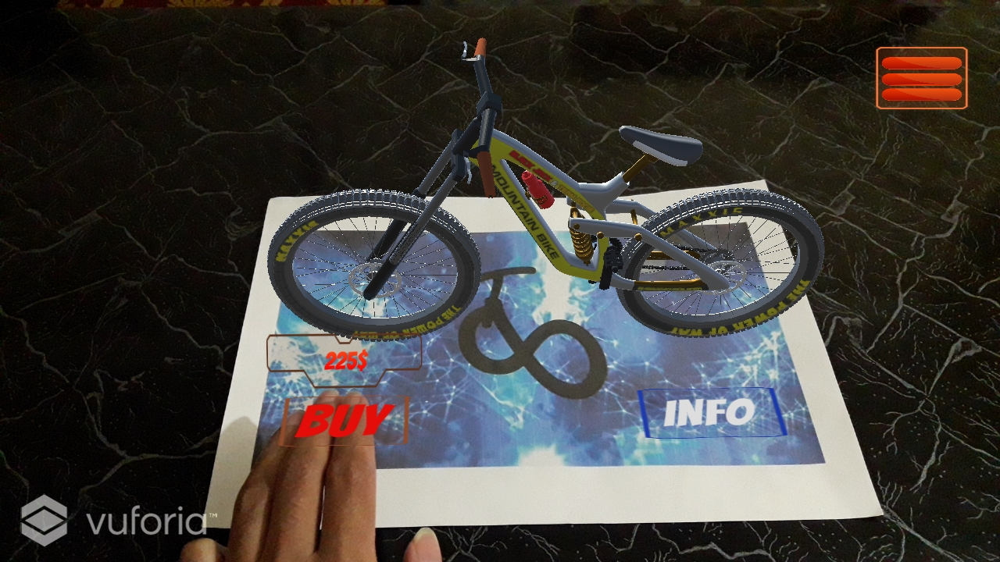
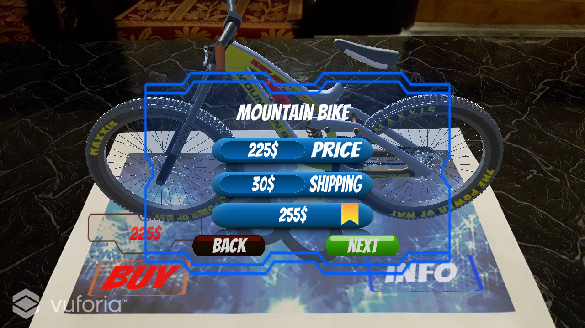
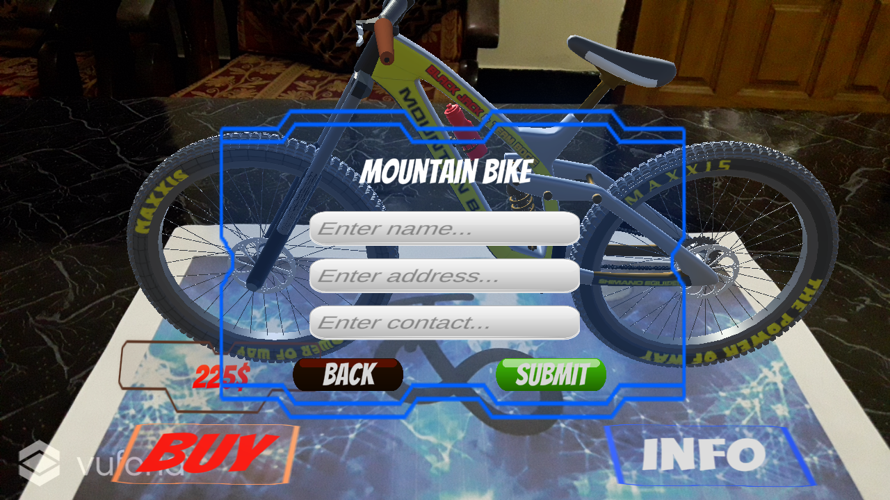

# AR_Store
E-commerce application with AR( Augmented Reality ) feature

## Purpose:
 - Show product and product details in augmented reality

## Platform:
 - Mobile Application ( for customer )
 - Web App ( for seller / order list )

## Visual Representation:
 Product list in menu

 to see product list click on top-right corner button

 3D view of Product

 __Info button__ to show / hide information bars

 __Information bars__

 __Buy__ button

 Overall __cost__

 Customer information form

